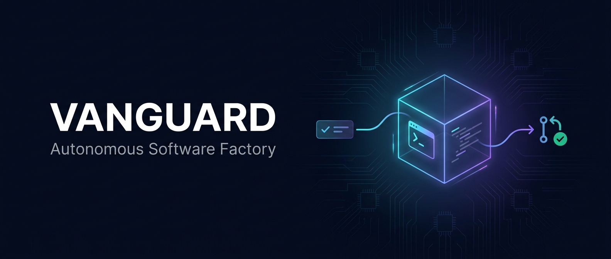

<p align="center">
  
</p>

<p align="center">
  <a href="https://github.com/SebaBoler/vanguard/actions/workflows/ci.yml"></a>
  =24" />
  
  
</p>

<p align="center">
  A self-improving software factory: take a task (Linear / GitHub), run a Claude Code agent in an
  isolated Docker sandbox on its own <code>git worktree</code>, and get back a reviewed, verifiable
  pull request. When the agent fails, you fix the <em>harness</em> — the prompt, the skill, the tool,
  the limit — not the agent's output, so the same failure can't happen twice. A standalone TypeScript
  framework, not a wrapper around another tool.
</p>

Status: Phase 1 (core engine), Phase 2 (task sources, pipeline, evals), and Phase 3 (adversarial review, human-in-the-loop, budget guardrails, dynamic MCP skills) are implemented and tested. Runs autonomously (AFK) as a `watch` loop; deployed always-on on Docker (Synology / Hetzner / any host).

## Design philosophy

Vanguard treats autonomous coding as an engineering system, not a prompt-and-pray script. Five principles separate it from "run an agent in a loop":

- **Harness over code.** Every agent failure is a *harness* failure. Instead of hand-fixing the agent's output, you fix the instruction, skill, tool, or sandbox limit so the system is immune to that failure class next time. Real cases this codebase hardened against: a macOS worktree-path mismatch, a dangling-symlink copy-back crash, and a Synology kernel with no CPU CFS scheduler — each became a permanent fix, not a one-off patch.
- **Trade-off reasoning.** System prompts state the *business cost* of decisions — a wrong or sloppy change costs reviewer trust and rework far more than the seconds a typecheck or test run takes — so the model spends "effort" (adaptive thinking) where it matters and escalates when it should, via the `<tradeoffs>` section of the default system prompt.
- **Token-efficiency by construction.** Sessions are captured to the host and resumed/forked to reuse cached context instead of paying twice for it; `cacheReadInputTokens` and a derived `cacheEfficiency` are first-class on every `RunResult` and tracked per stage. Real runs sit at 97–99% cache, which is what makes always-on AFK economical.
- **Evals-first.** A judge-scored eval suite over control (ambiguous), edge, and refusal/hand-off cases guards against regressions when a model or prompt changes — pass rate and verdict score, not subjective vibes.
- **Verifiable run artifacts.** Every run leaves an auditable trail under `.vanguard/runs/`: a per-stage transcript, a **git bundle of the exact changes**, the diff, one `run_complete` metric line (cost, tokens, cache efficiency, duration, exit reason), and optional host-driven Proof of Work with a SHA-256 over verification output. `vanguard stats` rolls it up across the fleet. This is what makes an AFK-generated PR trustworthy. The run also carries an optional host-driven Visual Proof for UI artifacts (see Visual proof below). *(Retrospective memory is also implemented: a deterministic host-side digest of prior failures and reviewer notes, fed back into later runs as advisory context.)*

## How it works

```
task source ──> [Spec loop] ──> [Agent loop] ──> commit ──> publish PR ──> dispose
 (Linear /      Planner          Implementer        Merger    (GitHub)       cleanup
  GitHub)       (read-only,      -> Reviewer
                posts spec,      -> Simplifier
                advances state)
```

**Loop v1 adds a layered two-pass flow before each implementation run:**

1. **Spec pass (Planner)** — Polls the spec-trigger (label or state). Runs triage: rejects vague tickets to needs-info before spending any model budget. If the ticket passes, runs `techSpecStage` (read-only: no code is written), posts the result as a `<tech_spec>` comment, then advances the ticket to the agent-trigger. A freshly-specced ticket is implemented on the **next poll** — the human has a window to review the spec before the agent runs.
2. **Agent pass (Implementer → Reviewer → Simplifier)** — Polls the agent-trigger. Runs triage again in `agent` mode: rejects tickets that lack acceptance criteria or a spec comment before spending implement budget. If the ticket passes, runs the full stage pipeline and opens a draft PR.

The agent runs inside the sandbox. The host owns all file sync (`copyIn` / `copyFileOut`) and secrets. A run stops when the agent emits `<promise>COMPLETE</promise>`.

## Layers

- **Sandbox** (`IsolatedSandboxProvider`): `DockerSandboxProvider` for local and Linux hosts, `FirecrackerSandboxProvider` for microVMs on a KVM host. Resource limits, tmpfs secrets, streaming exec.
- **Worktree** (`WorktreeManager`): one git worktree per task. Cleanup keeps a worktree that still has uncommitted changes.
- **Agent** (`AgentProvider`): `ClaudeCodeProvider` runs the in-sandbox `claude` CLI (effort levels, stream-json, usage and cost). `PiProvider` is a Phase 2 stub.
- **Context**: a prompt engine (`{{KEY}}` placeholders and `` !`cmd` `` expansion run in the sandbox), `buildXmlPrompt` for XML-tagged prompts, and `SkillRegistry` for injecting tools.
- **Pipeline**: `runStages` chains stages over one shared worktree and session. Built-in stage sets: Implementer/Reviewer/Simplifier, Generate/Evaluate/Repair, and Plan/Implement/Adversary (a red-team reviewer that reports `<findings>` without editing). `commitStage` and `publishForReview` are the Merger.
- **Guardrails**: `runBudgetedStages` enforces a hard cost ceiling and freezes the run (`budget_exceeded`) for resume after a raise; `runJudgedRepair` freezes to `needs_human` after three rejected repairs, leaving the sandbox live for `shellCommand()` entry.
- **Evals**: `runEvals` scores cases (control, edge, refusal) with a programmatic or LLM judge.

## Quick start

```bash
pnpm install
pnpm build
docker/build.sh                 # builds vanguard-sandbox (node + git + claude + linear CLIs)
```

Run the smoke example against a throwaway repo:

```bash
CLAUDE_CODE_OAUTH_TOKEN=$(op read "op://Vault/Anthropic/token") pnpm tsx examples/smoke.ts
```

## Task sources (pick one)

`TaskFetcher` abstracts the source, so one deployment uses a single source of truth.

```ts
const fetcher = new LinearCliTaskFetcher({ team: 'ENG' });          // Linear (via the linear CLI)
const fetcher = new GitHubTaskFetcher('owner/repo');                    // GitHub Issues
const fetcher = new GitHubProjectFetcher({ owner, projectNumber, repo });// GitHub Projects v2
```

GitHub is also the review surface: `publishForReview` opens a PR, and `linkPullRequest` / `linkLinearIssue` comment the PR link back onto the source issue.

`LinearCliTaskFetcher` drives Linear entirely through the `linear` CLI (from schpet/linear-cli; authenticate with `linear auth login` or set `LINEAR_API_KEY`), covering fetch/list/comment with no SDK dependency. The CLI's skill (SKILL.md in that repo) can be injected via `skillRegistryFromDirectory` so the agent uses it directly. Confirm the `linear issue query --json` field shape against your workspace before relying on it.

## Auth

Subscription is the default and draws on your Claude plan credits. The API key is the alternative and bills the Developer Platform. Vanguard injects exactly one secret into the sandbox, so billing is unambiguous.

```bash
claude setup-token            # once, generates the subscription token
CLAUDE_CODE_OAUTH_TOKEN=...    # subscription (default)
ANTHROPIC_API_KEY=...          # API billing instead
```

See `.env.example`. `authFromEnv()` prefers the subscription token; `authSecrets(auth)` maps the choice to the single env var the sandbox receives.

### Local secrets (two ways)

Vanguard reads everything from env vars (`ANTHROPIC_API_KEY` or `CLAUDE_CODE_OAUTH_TOKEN`, `LINEAR_API_KEY`, `GH_TOKEN`). Locally, populate them however you like:

**Plain env / `.env`:**

```bash
cp .env.example .env && $EDITOR .env       # fill in the keys (gitignored)
set -a; . ./.env; set +a                    # load into the shell
node dist/cli/index.js watch --label vanguard --repo . --skills ./skills
```

**1Password (`op`), no plaintext on disk** — read each secret inline per run, so it never lands in a file or shell history:

```bash
LINEAR_API_KEY=$(op read "op://Personal/Linear API/credential") \
CLAUDE_CODE_OAUTH_TOKEN=$(op read "op://Personal/Claude OAuth/credential") \
  node dist/cli/index.js run --linear TES-1 --repo . --skills ./skills
```

`op` (1Password CLI) needs `op signin` or the desktop app integration; its sessions can expire between calls, so prefer reading the secrets in the same command that uses them. On a server there is no 1Password — see [docs/deploy.md](docs/deploy.md#secrets-no-1password-on-the-server).

## End to end

```ts
const task = await fetcher.fetch('123');
const ctx = await prepareContext({ taskId: task.id, localRepoPath, sandbox });
try {
  await runStages(ctx, implementReviewSimplifyStages(), { agent, variables: taskToVariables(task) });
  const commit = await commitStage(ctx, { message: `feat: ${task.title}` });
  if (commit.committed) await publishForReview(ctx, { title: task.title });
} finally {
  await disposeContext(ctx);
}
```

`examples/from-github-issue.ts` runs this whole loop from a GitHub issue.

## Skills

Vanguard supports Claude Code skills (the `SKILL.md`-per-directory format used by collections like [obra/superpowers](https://github.com/obra/superpowers), [mattpocock/skills](https://github.com/mattpocock/skills), and [cursor-team-kit](https://github.com/cursor/plugins/tree/main/cursor-team-kit/skills)). Point a registry at a directory of skills and Vanguard injects the whole set into the agent's `~/.claude/skills` inside the sandbox. The agent auto-discovers and selects the relevant ones at runtime, so there is no per-run list to maintain.

```ts
import { skillRegistryFromDirectory, run } from 'vanguard';

// Clone a skills collection into ./skills (each subdir with a SKILL.md is one skill).
const skills = await skillRegistryFromDirectory('./skills');
await run(opts, { skills });
```

For targeted injection instead of the whole set, construct `new SkillRegistry({ id: '/host/path' })` and call `inject(['id'], sandbox)`.

### Example: the linear-cli skill

[schpet/linear-cli](https://github.com/schpet/linear-cli) ships a skill at `skills/linear-cli/` that teaches the agent to drive the `linear` CLI directly. The sandbox image already includes the `linear` CLI, so you only inject the skill and forward `LINEAR_API_KEY`:

```bash
git clone --depth 1 https://github.com/schpet/linear-cli /tmp/linear-cli
```
```ts
const skills = await skillRegistryFromDirectory('/tmp/linear-cli/skills'); // registers the linear-cli skill
const sandbox = new DockerSandboxProvider({ secrets: { ...authSecrets(auth), LINEAR_API_KEY: process.env.LINEAR_API_KEY! } });
await run({ ...opts, sandbox }, { skills });
```

The agent then auto-discovers the skill and can read or update Linear from inside the sandbox.

## Models

Choose the model per stage with `model` (`'opus'`, `'sonnet'`, `'haiku'`, or a full id), and reasoning depth with `effort`. Two presets:

- `fastStages()` - a single low-effort `haiku` pass: cheap and quick, still on the subscription via the CLI.
- `planImplementReviewStages()` - plan on `opus` (high effort, emits a `<plan>`), then implement and review on `sonnet`. The capable model plans; the cheaper one executes.

Runs reuse the session and keep a stable prompt prefix to maximize Anthropic prompt caching; `RunResult.cacheEfficiency` reports the cached fraction of input tokens.

## Providers

The agent behind each stage is a swappable `AgentProvider`: `claude` (Claude Code CLI, default), `codex` (OpenAI Codex CLI), or `cursor` (Cursor CLI). Selection is **by provider, not by model** — each provider runs on its own default model. Two modes:

**One provider does everything** (default)

```bash
vanguard run --linear TES-1                 # Claude implements + reviews + simplifies
vanguard run --linear TES-1 --provider codex # Codex runs every stage
```

**Cross-provider review** (opt-in) — the implementer stays on the main provider while only the review stage runs on an independent one, so a different model family catches different classes of bugs:

```bash
vanguard run    --linear TES-1 --provider claude --review-provider codex
vanguard watch  --label vanguard --provider codex --review-provider claude
```

**Per-stage model** (independent of provider) — `--provider-model <m>` sets the model for the implementer/simplifier stages and `--review-model <m>` for the review stage; each defaults to the provider's own default model. Mix freely with provider selection:

```bash
vanguard run --linear TES-1 --provider-model opus --review-model haiku   # plan/implement big, review cheap
```

`--provider` / `--review-provider` / `--provider-model` / `--review-model` work the same on `run` and `watch`. The simplifier stays on the main provider. Each non-Claude provider brings its own key, forwarded into the sandbox **only when that provider is selected**: `CODEX_API_KEY` for codex, `CURSOR_API_KEY` for cursor (a missing key fails fast at dispatch, not mid-run). Under `--llm-proxy` the Codex/OpenAI key is held by a trusted sidecar instead of the sandbox (see [Host LLM proxy](#host-llm-proxy) below); Cursor's key is still injected directly (not yet proxied). Claude auth is the baseline (`CLAUDE_CODE_OAUTH_TOKEN` or `ANTHROPIC_API_KEY`). The sandbox image ships the `claude` and `codex` CLIs; selecting `cursor` also needs its CLI added to the image (`curl https://cursor.com/install -fsS | bash`).

Codex does not read its key straight from the environment: `CodexProvider` runs `codex login --with-api-key` (the key piped from `OPENAI_API_KEY` inside the sandbox, never on the command line) before `codex exec`. Under `--llm-proxy` Codex is instead configured (via `~/.codex/config.toml`) to use a custom OpenAI-compatible provider pointed at the trusted sidecar, reading only the per-run nonce from `OPENAI_API_KEY` (no `codex login`, and the real key never enters the sandbox). Either way, the OpenAI account behind the key must have active billing — without it `codex exec` connects and authenticates but the API returns "account is not active", which surfaces as a failed review stage.

## Fork-and-select

`run --fork <n>` runs the implementer stage `n` times (each variant forks the same base, on a worktree reset between runs), scores each variant's diff, and keeps the best one before the review/simplify stages continue. Scoring is an LLM verdict produced by a one-shot run of the same provider in a throwaway `/tmp` cwd (the diff is supplied in the prompt, so the scorer never touches the worktree). Use it to trade tokens for quality on hard tasks:

```bash
vanguard run --linear TES-1 --fork 3
```

## Security

The sandbox is the blast radius, not the host. Secrets reach the sandbox through an in-RAM tmpfs file (POSIX-quoted, never in `docker inspect` or on disk), never via argv. Host subprocesses use argument arrays, never shell strings. `.env` is a template only; no secrets live in the repo. The base image is pinned by digest; SIGINT/SIGTERM destroy live sandboxes and a host concurrency limit caps how many run at once. Generate an image SBOM with `pnpm sbom` (needs syft). `vanguard run --egress` confines the sandbox to an internal docker network whose only route out is a proxy sidecar that tunnels just the allowlist (anthropic/github/linear/registries), so even a process that ignores the proxy has no route out.

### Host LLM proxy

`vanguard run --llm-proxy` (also on `watch`) keeps the real Anthropic credential out of the sandbox entirely. A trusted reverse-proxy sidecar holds the credential; the sandbox is handed only a random **per-run nonce** as `ANTHROPIC_AUTH_TOKEN` and points `ANTHROPIC_BASE_URL` at the sidecar. The sidecar validates the nonce, swaps in the real credential (OAuth `Authorization: Bearer` or `x-api-key`), and is the only thing that talks to `api.anthropic.com`.

The same nonce/sidecar pattern now also covers Codex/OpenAI when Codex is selected with `--llm-proxy`: a separate OpenAI sidecar holds the real OpenAI key, the sandbox gets a nonce as `OPENAI_API_KEY` plus a base URL pointed at that sidecar, and `api.openai.com` is dropped from the sandbox allowlist alongside `api.anthropic.com`.

The flag **implies `--egress`** and additionally **removes `api.anthropic.com` from the sandbox's allowlist**, so the sandbox has no direct route to Anthropic — its only path to the model is through the sidecar. The invariant: the real key never enters the sandbox; a leaked nonce is useless beyond the run and never reaches Anthropic. `--llm-proxy` now protects both Claude and Codex/OpenAI provider keys. Cursor is not yet proxied — selecting `cursor` with `--llm-proxy` still injects `CURSOR_API_KEY` directly into the sandbox (a stable Cursor base-url proxy is planned).

See [docs/smoke-tests/codex-openai-proxy.md](docs/smoke-tests/codex-openai-proxy.md) for the current verification status, a zero-cost negative preflight check, and a controlled live runbook that walks through the Codex/OpenAI proxy preflight and a read-only `review-pr` smoke run when active OpenAI billing is available.

## Development

```bash
pnpm typecheck
pnpm test
```

Node 24+, pnpm, Vitest, ESM with NodeNext. Tests are co-located as `*.test.ts`. Docker integration tests run when Docker is present and skip otherwise.

## Autonomous loop

`vanguard watch` polls a source for ready items and runs each one by itself (claim → run → PR → move to review): `--source linear` (trigger = state type + label) or `--source github` (open issues with labels). Each run implements, then **reviews and simplifies its own diff in a fresh, independent context** using the bundled `skills/` (code-review + simplify) injected into the sandbox. Loop v1.1 adds safe defaults so GitHub can be started with `vanguard watch --source github --github-repo owner/repo`, and Linear with `vanguard watch --loop-v1 --label vanguard`. To run it always-on in Docker on Synology / Hetzner / any host, see [docs/deploy.md](docs/deploy.md).

### Loop v1 — two-pass autonomous pipeline

Loop v1 adds a deterministic Spec pass before every Agent pass. Routing differs by source:

**GitHub (routes by LABELS):**

`--label` (e.g. `vanguard`) is an optional **ownership** label for GitHub: when supplied, an issue is only picked up if it carries it *in addition to* the routing label below. The short GitHub command does not require it because the repo plus `ready for spec` / `ready for agent` already define the loop lane.

| Routing label | What happens |
|---|---|
| `ready for spec` | Spec pass triggers. Triage runs first — vague tickets get a clarification comment + relabelled `needs info` (no model budget spent). Valid tickets: `techSpecStage` posts a `<tech_spec>` comment, issue relabelled `ready for agent`. If `--label` is supplied, the issue must also carry that ownership label. |
| `ready for agent` | Agent pass triggers (next poll after spec, or immediately for directly-labelled issues). Triage runs again — no spec or acceptance criteria → `needs info`. Valid tickets: full Implementer → Reviewer → Simplifier pipeline → draft PR. If `--label` is supplied, the issue must also carry that ownership label. |
| `needs info` | Parked. Human updates the ticket and moves it back. |

> **Note on the issue template:** The [Vanguard Task template](.github/ISSUE_TEMPLATE/vanguard-task.md) defaults to `ready for agent` only. The spec loop runs when a human downgrades the label to `ready for spec` (for high-level ideas that need a research + planning pass first). Leaving the label as `ready for agent` skips the spec pass and goes straight to implementation — this is intentional, not a bug. Add an ownership label such as `vanguard` only when your watcher is started with `--label vanguard`.

```bash
# GitHub Loop v1.1 defaults
vanguard doctor --source github --github-repo owner/repo
vanguard watch --source github --github-repo owner/repo

# GitHub Loop v1 with custom labels/model
vanguard doctor --source github --github-repo owner/repo --label vanguard \
  --spec-label "ready for spec" \
  --agent-label "ready for agent" \
  --needs-info-label "needs info"
vanguard watch --source github --github-repo owner/repo \
  --label vanguard \
  --spec-label "ready for spec" \
  --agent-label "ready for agent" \
  --needs-info-label "needs info" \
  --spec-model haiku
```

**Linear (routes by STATES):**

| State condition | What happens |
|---|---|
| State TYPE matches `--spec-state` (e.g. `triage`) + label | Spec pass triggers. Triage runs first — vague tickets get a clarification comment + moved to Needs Info state (no model budget spent). Valid tickets: `techSpecStage` posts a `<tech_spec>` comment, issue moved to the agent-trigger state (`--agent-state`, default `Todo`). |
| State TYPE matches `--trigger-state` (default `unstarted`) + label | Agent pass triggers (next poll after spec, or for any pre-specced issue). Triage runs in `agent` mode — vague tickets moved to `--needs-info-state`. Valid tickets: Implementer → Reviewer → Simplifier → draft PR. |
| Needs Info state | Parked. Human updates the ticket and moves it back. |

```bash
# Linear Loop v1.1 defaults
vanguard doctor --loop-v1 --label vanguard
vanguard watch --loop-v1 --label vanguard

# Linear Loop v1 with custom states/model
vanguard doctor --loop-v1 --label vanguard --spec-state triage --spec-state-name Spec \
  --needs-info-state "Needs Info" --agent-state Todo
vanguard watch --loop-v1 --label vanguard \
  --spec-state triage \
  --spec-state-name Spec \
  --needs-info-state "Needs Info" \
  --agent-state Todo \
  --spec-model haiku
```

**Shared behaviour (both sources):**

- `vanguard doctor` runs the AFK preflight without claiming work. It checks Node 24+, LLM auth, repo remote, Docker daemon, `vanguard-sandbox:latest`, source auth, GitHub routing labels, and Linear env/skills setup.
- Triage is deterministic (`assessTaskReadiness`) and rejects under-specified tickets before spending any model tokens.
- The spec stage is read-only: it posts a `<tech_spec>` comment but never writes code or opens a PR.
- A freshly-specced ticket is implemented on the **next poll** (human intervention window before the agent runs).
- The human role is to write good tickets + approve the final PR. The [issue template](.github/ISSUE_TEMPLATE/vanguard-task.md) is the intended intake path.
- External PR review is available as a one-shot `review-pr` command, an always-on `watch-prs` polling loop, or a GitHub Actions label trigger.

Operator logs stay terse and progress-oriented so always-on runs are scannable:

```text
preflight: node 24 ok
preflight: llm auth ok
preflight: github labels ok
spec: poll -> 1 ready
spec owner/repo#123: claim -> triage
spec owner/repo#123: advanced -> next poll agent
watch: poll -> 1 ready
watch owner/repo#124: claim -> running
watch owner/repo#124: pr opened -> review
```

Normal logs report source, task id, phase, outcome, and next action. Full prompts, diffs, transcripts, and proof details stay in `.vanguard/runs/`.

### External PR review

`vanguard review-pr` runs an adversarial, read-only review over an existing GitHub PR diff and posts a non-blocking GitHub review comment. It does not edit code, open another PR, or move issue labels.

```bash
vanguard review-pr https://github.com/owner/repo/pull/123
vanguard review-pr --github-pr 123 --github-repo owner/repo --provider codex --review-model gpt-5
```

`vanguard watch-prs` turns that reviewer into a small PR loop. It polls only PRs with an explicit trigger label, skips drafts and Vanguard/bot-authored PRs, swaps labels while reviewing, and restores the trigger label on failure so the next poll can retry. Pass `--author <login>` to restrict the loop to a single author's PRs (self-review-only). Successful reviews include a hidden `headRefOid` marker, so the loop skips the same commit if the trigger label is re-added accidentally.

```bash
vanguard doctor-prs --github-repo owner/repo --label "ready for vanguard review"
vanguard watch-prs --github-repo owner/repo --label "ready for vanguard review"
vanguard doctor-prs --github-repo owner/repo \
  --label "ready for vanguard review" \
  --reviewing-label "vanguard:reviewing" \
  --reviewed-label "vanguard:reviewed"
vanguard watch-prs --github-repo owner/repo \
  --label "ready for vanguard review" \
  --reviewing-label "vanguard:reviewing" \
  --reviewed-label "vanguard:reviewed" \
  --author owner \
  --provider codex \
  --review-model gpt-5
```

| PR label state | What happens |
|---|---|
| `ready for vanguard review` | Picked up on the next poll. The label is removed and `vanguard:reviewing` is added before the review starts. |
| `vanguard:reviewing` | Claimed/in progress. Later polls skip it. |
| `vanguard:reviewed` | Review comment posted successfully. Re-add the trigger label after new commits if you want another review pass; the same commit is deduped by the hidden review marker. |

Operator logs stay compact:

```text
review-pr owner/repo#123: fetch -> diff
review-pr owner/repo#123: agent -> reviewing
review-pr owner/repo#123: posted -> pr review
review-pr owner/repo#123: done
watch-prs: poll -> 1 ready
watch-prs owner/repo#123: claim -> reviewing
watch-prs owner/repo#123: reviewed -> marked
```

#### GitHub Actions trigger

`.github/workflows/vanguard-pr-review.yml` fires on `pull_request_target` when the `ready for vanguard review` label is applied to a PR, and can also be triggered manually via `workflow_dispatch` to sweep all currently-labeled PRs.

**Required secrets:** `CLAUDE_CODE_OAUTH_TOKEN` — the Claude subscription OAuth token. The built-in `GITHUB_TOKEN` provides PR/label write access automatically.

**Security model:** the workflow uses `pull_request_target` because posting reviews requires repo secrets and write permissions. It checks out only the base branch — PR head code is never fetched or executed. The model credential stays inside the `--llm-proxy` sidecar, which also restricts sandbox egress to an allowlist, so the untrusted PR diff cannot exfiltrate the model credential. It is **self-review-only**: the job condition requires `github.event.pull_request.user.login == 'SebaBoler'` and the review pass runs with `--author SebaBoler`, so only the maintainer's own PRs are ever reviewed — another contributor's PR is skipped even if labeled.

**Behavior:** each label event runs `watch-prs --once --author SebaBoler`, which reviews only the maintainer's PRs carrying the trigger label (not another contributor's, and not only the just-labeled one). This is idempotent: already-reviewed commits are skipped via the hidden `headRefOid` marker and the label swap.

**Re-review:** after new commits land, remove and re-add `ready for vanguard review` to trigger a fresh pass.

**Label setup:** the workflow creates the three routing labels idempotently on every run (`gh label create --force`), so no manual label setup is needed in a fresh repo.

**Relationship to always-on `watch-prs`:** both modes watch the same label; dedupe makes running both safe but redundant — pick one per repo.

Run `vanguard gc --remote <owner/repo>` on a timer (cron or systemd) to reap stale sandboxes, worktrees, and merged branches — see [Garbage collection](docs/deploy.md#garbage-collection) for cron and systemd-timer examples.

Each run appends a `run_complete` metric line per stage to `.vanguard/runs/metrics.jsonl` (cost, tokens, cache efficiency, duration, exit reason). `vanguard stats` aggregates that into a rollup — per task, per stage, and a grand total — for fleet cost/time visibility (`--json` for machine output).

## Retrospective memory

`vanguard memory` reads `.vanguard/runs` artifacts — failed runs, failed proofs, and reviewer notes (not diffs or transcripts) — and refreshes a short, redacted digest at `.vanguard/memory/retrospective.md`. It is deterministic (no LLM): a host-side rollup, advisory only.

Subsequent `run`, `watch`, and spec runs automatically load that digest into the implementer and tech-spec prompts as advisory context ("use only when relevant"); the digest refreshes best-effort after each run. `.vanguard/` is gitignored — this is operational host state, not committed source.

```bash
vanguard memory                 # refresh + print the digest
vanguard memory --json          # machine-readable report
vanguard memory --limit 20      # keep the 20 most recent entries
```

## Proof of work

After the agent finishes, the host (not the agent) runs a verification command inside the sandbox, captures its stdout and stderr, computes a SHA-256 over the combined output, and stamps a Proof of Work block into the PR body and the run record. The agent cannot fake it.

Command precedence: `--verify "<cmd>"` flag > `VANGUARD_VERIFY_CMD` env > auto-detect from the worktree `package.json` (if a `test` script exists, the host builds `<pm> install --frozen-lockfile [&& <pm> run typecheck] && <pm> test`) > skip (no command resolved means no block, PR body unchanged).

On failure the PR always opens, the body carries a `FAIL` Proof of Work block (command, exit code, SHA-256, and an output tail), and a `vanguard:verify-failed` label is added to the PR (best-effort).

```bash
vanguard run --linear TES-1 --verify "pnpm typecheck && pnpm test"
# or set for all runs:
VANGUARD_VERIFY_CMD="pnpm typecheck && pnpm test" vanguard watch --label vanguard
```

## Visual proof

After the agent finishes, the host (not the agent) optionally runs a user-supplied visual proof command inside the sandbox — for UI changes that produce screenshots or visual artifacts (e.g. Playwright). It captures stdout and stderr, computes a SHA-256 over the combined output, lists the artifacts the command wrote under `/workspace/.vanguard/visual-proof`, hashes each one (a manifest of path + SHA-256 + byte size — artifacts are not copied out in this version), and stamps a Visual Proof block into the PR body and the run record.

Command precedence: `--visual-proof "<cmd>"` flag > `VANGUARD_VISUAL_PROOF_CMD` env > skip. Unlike Proof of work, there is no auto-detect — if no command is resolved, there is no visual proof and the PR body is unchanged.

Allowed artifact extensions: `.png`, `.jpg`, `.jpeg`, `.webp`, `.gif`, `.svg`, `.html`, `.json`.

Visual proof failure never blocks the PR: the PR always opens, and on a non-zero exit — or if a configured command can't be executed at all (sandbox crash, cancel, timeout) — the body carries a `FAIL` Visual proof block (a crash is recorded with exit code `-1`) and a `vanguard:visual-proof-failed` label is added to the PR (best-effort). A requested proof is never silently dropped; only when no command is configured is there no block.

```bash
vanguard run --github 123 --visual-proof "pnpm exec playwright test --project=chromium"
# or set for all runs:
VANGUARD_VISUAL_PROOF_CMD="pnpm exec playwright test --project=chromium" vanguard watch --label vanguard
```
